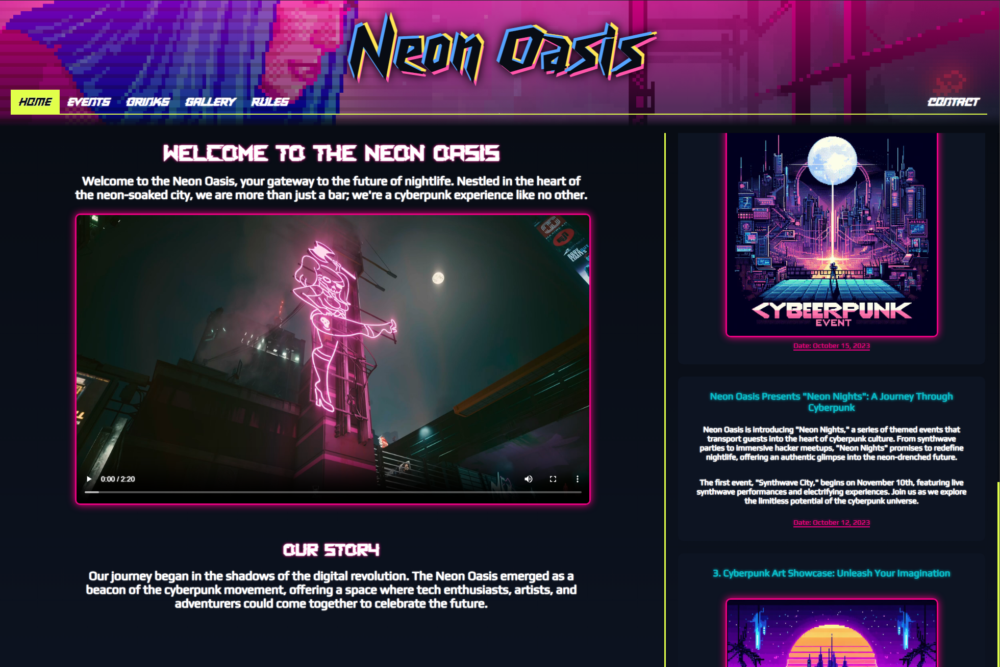
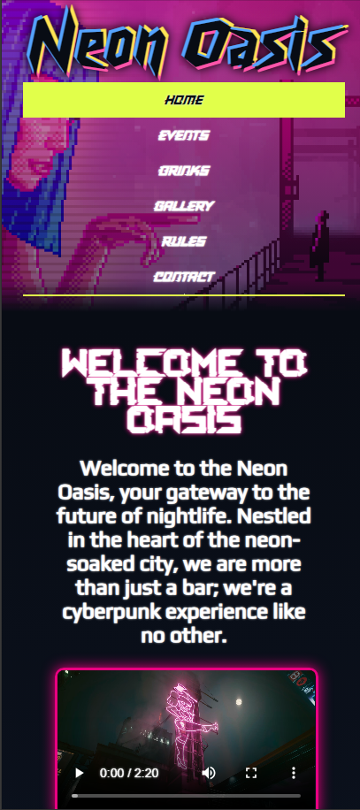

# Neon Oasis

## Overview
This project is a Cyberpunk-themed bar website created as part of the module **"Selected Areas of Human-Computer Interaction"**. The website was developed using **HTML5** and **CSS** without the use of frameworks.

## Dekstop Version

## Mobile Version

## Features
The website includes the following pages:

- **Home**: Introduction and overview of Neon Oasis.
- **Events**: Upcoming events and special nights.
- **Drinks**: Menu of drinks available at the bar.
- **Gallery**: AI-generated images showcasing the bar's ambiance.
- **Rules**: House rules and guidelines.
- **Contact**: Contact information and inquiry form.

### Design Features
- **Cyberpunk Theme**: Enhanced with unique fonts and colors.
- **Responsive Layout**: Adjusts automatically for 1-, 2-, 3-, and 4-column designs using `display: grid`.

## Installation & Usage
1. Download and extract the project.
2. Open `index.html` in a modern web browser.
3. Navigate through the various pages to explore the Cyberpunk-themed content and design.

## Requirements
- A modern web browser supporting HTML5 and CSS.
- The website has been tested in Firefox and another browser for compatibility.

## Notes
- **Code Quality**: The code is manually written and well-structured, focusing on maintainability and avoiding unnecessary redundancies.
- **Images**: All images are AI-generated and incorporated into the design.

Enjoy your virtual visit to Neon Oasis!

